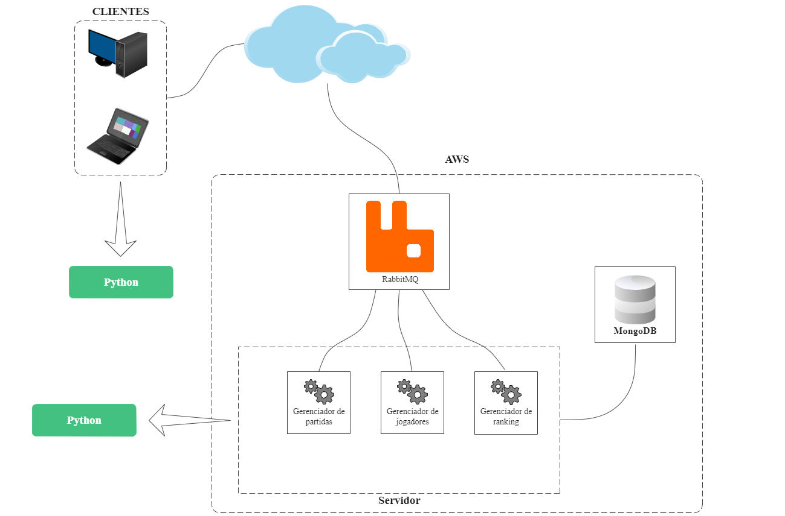
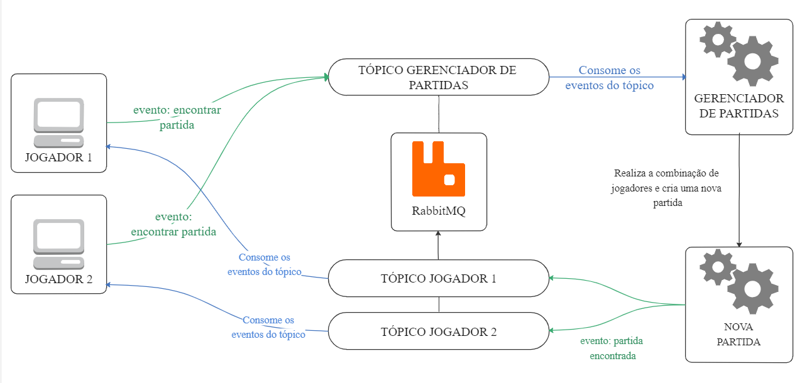
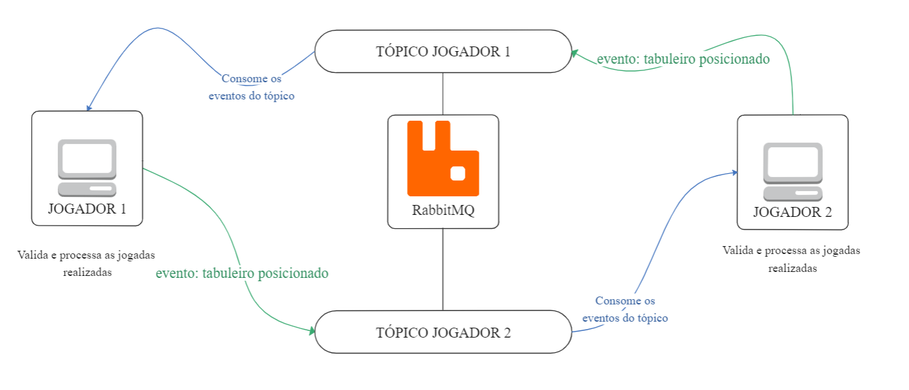
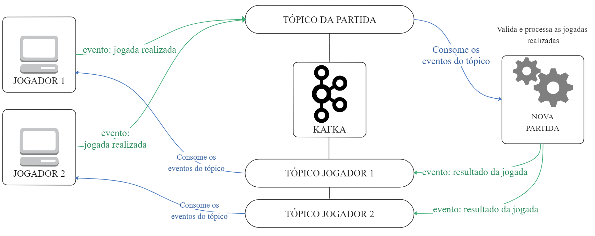

# Documentation

## Table of contents
* [Arquitetura](#arquitetura)
    * [Tecnologias](#tecnologias)
    * [Diagramas e fluxo](#diagramas-e-fluxo)
* [Interface](#interface)
    * [Gerenciador de Jogadores](#gerenciador-de-jogadores)
    * [Gerenciador de Partidas](#gerenciador-de-partidas)
    * [Gerenciador de Ranking](#gerenciador-de-ranking)

## Arquitetura

A arquitetura será *baseada em eventos*, no modelo Publish / Subscriber.
O cliente irá consumir e gerar eventos conforme a ação sendo executada pelo usuário.
O servidor será constituído por *microsserviços* que irão consumir e gerar eventos e dados:
- Gerenciador de partidas: Responsável por criar e gerenciar partidas
- Gerenciador de jogadores: Responsável por cadastrar novos jogadores e gerenciar a interação entre eles
- Gerenciador de Ranking: Responsável por registrar, ordenar e filtrar os pontos dos jogadores 

### Tecnologias
- Para o gerenciamento dos eventos no modelo Publish / Subscriber será realizado pelo **RabbitMQ**
- A implementação do cliente será realizada em **Python**
- A implementação do servidor será realizada em **Python**
- A persistencia dos dados será feita com **MongoDB**
- O Servidor ficará hospedado em uma das plataformas: **AWS**, **DigitalOcean** ou **Google Cloud Platform**

### Diagramas e fluxo
Diagrama geral da arquitetura:

O fluxo de um jogo é dividido em algumas etapas:

* **Etapa 1**: Os jogadores entram na fila para encontrar uma partida, o gerenciador de partidas combina os jogadores e inicia uma nova partida.

    Cada jogador gera um evento de encontrar partida que será consumido pelo gerenciador de partidas. Uma nova partida gera um evento de partida encontrada indicando aos jogadores participantes que podem posicionar seuas embarcações.

Diagrama da etapa 1:

* **Etapa 2**: Os jogadores posicionam suas embarcações, quando ambos tiveram finalizado essa terefa a partida se inicia.

    Cada jogador ao finalizar de posicionar suas embarcações gera um evento de embarcações posicionadas, esse evento é publicado para o jogador oponente. Quando ambos os jogadores tiverem recebido o evento de que seu oponente posicionou o tabuleiro, o jogo se inicia.

Diagrama da etapa 2:

* **Etapa 3**: Os jogadores realizam suas jogadas alternadamente, as jogadas enviadas para o oponente.

    Ao realizar uma jogada válida o jogador gera um evento de jogada realizada. Esse evento é enviado para o oponente para ele atualizar seu tabuleiro. Esse processo se repete, com cada jogador realziando a jogada de forma alternada, até o fim da partida.

Diagrama da etapa 3:

Após uma jogada levar ao evento de fim de partida, os jogadores recebem esse evento informando o jogador vencedor. O mesmo evento também será publicado no tópico do gerenciador de ranking para que ele possa atualizar devidamente a pontuação do jogador vencedor.

-----------

## Interface

### Gerenciador de Jogadores:
- Criar novo jogador
    - Recebe os dados do novo jogador (nome, usuário, senha) como parâmetros
    - Retorna uma mensagem de sucesso caso o jogador seja registrado
    - Retorna uma mensagem com a descrição do erro em casos de falha
- Logar
    - Recebe os dados de login do jogador (usuário, senha) como parâmetros
    - Retorna uma mensagem de sucesso caso as credencias estavam corretas
    - Retorna uma mensagem com a descrição do erro em casos de falha
- Buscar jogador "x"
    - Recebe usuário do jogador como parâmetro
    - Retorna uma mensagem com os dados do jogador em casos de sucesso
    - Retorna uma mensagem de jogador não encontrado se o jogador não existir
    - Retorna uma mensagem com a descrição do erro em casos de falha

### Gerenciador de Partidas:
- Encontrar partida
    - Recebe usuário do jogador como parâmetro
    - Retorna a confirmação de entrada na fila em casos de sucesso
    - Retorna uma mensagem com a descrição do erro em casos de falha
- Iniciar partida
    - Recebe os dados dos jogadores na partida (usuários e códigos) como parâmetros
    - Retorna os dados da nova partida em casos de sucesso (UUID, horário de inicio)
    - Retorna uma mensagem com a descrição do erro em casos de falha
- Desistir da partida
    - Recebe o UUID da partida como parâmetro
    - Retorna a conformação da rendição em casos de sucesso
    - Retorna uma mensagem com a descrição do erro em casos de falha
- Contabilizar Ranking
    - Recebe usuário do jogador e pontuação a ser adicionada como parâmetros
    - Retorna uma mensagem de sucesso caso a pontuação tenha sido atualizada
    - Retorna uma mensagem com a descrição do erro em casos de falha

### Gerenciador de Ranking:
- Listar Ranking
    - Recebe uma string informando a ordem de ordenação
    - Retorna a lista de ranking atualizada ordenada por pontuação na ordem solicitada em casos de sucesso
    - Retorna uma mensagem com a descrição do erro em casos de falha
- Buscar Ranking do jogador "x"
    - Recebe uma string como parâmetro
    - Retorna uma lista de rankings de jogadres que contem essa string no usuário
    - Retorna uma mensagem com a descrição do erro em casos de falha
- Buscar ultimas atualizações
    - Retorna o ranking ordenado de forma descrescente pelos valores de data da última atualização
    - Retorna uma mensagem com a descrição do erro em casos de falha
